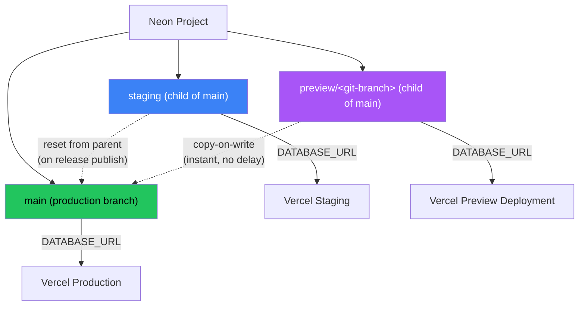

# Neon DB + Vercel Integration Architecture

> Reference document for the intake-tracker project's Neon database and Vercel deployment integration.
> Last updated: 2026-04-06

---

## Overview

This project uses **NeonDB** via the **Neon-Managed Vercel Integration** (installed from the Vercel marketplace, billed through Neon). Only push notification infrastructure currently uses NeonDB -- four server-side tables in `src/lib/push-db.ts`. All 16 health tracking tables remain client-side in IndexedDB via Dexie.js (`src/lib/db.ts`). The Neon integration automatically provisions isolated branch databases for each Vercel deployment environment.

---

## Current State

### What NeonDB Is Used For Today

**Single consumer:** `src/lib/push-db.ts` using `@neondatabase/serverless` (v1.0.2)

| Table | Purpose | Key Operations |
|-------|---------|---------------|
| `push_subscriptions` | VAPID push subscription storage per user | Upsert on subscribe, delete on unsubscribe |
| `push_dose_schedules` | Medication reminder schedules (time_slot + day_of_week) | Full sync (delete + re-insert) on schedule change |
| `push_sent_log` | Deduplication log for sent notifications | Insert on send, query for dedup |
| `push_settings` | Per-user notification preferences (enabled, follow-up count, interval, day start hour) | Upsert on settings change, read with defaults |

**Access pattern:**
- Raw SQL via `neon()` tagged template driver -- no ORM
- Server-only access through Next.js API routes
- Connection string (`DATABASE_URL`) never reaches the client
- Security enforced by `src/__tests__/bundle-security.test.ts` which verifies `DATABASE_URL` is not in the client bundle

**What is NOT in NeonDB:**
- All 16 Dexie.js tables: `intakeRecords`, `weightRecords`, `bloodPressureRecords`, `eatingRecords`, `urinationRecords`, `defecationRecords`, `substanceRecords`, `prescriptions`, `medicationPhases`, `phaseSchedules`, `inventoryItems`, `inventoryTransactions`, `doseLogs`, `titrationPlans`, `dailyNotes`, `auditLogs`
- These remain entirely in the browser's IndexedDB with no server-side sync

---

## Branch Database Lifecycle

### Architecture Diagram

### Branch Types

**Production (`main`)**
- Default Neon branch, marked as the production branch
- Connected to the Vercel production environment
- `DATABASE_URL` points here for all production deploys
- A snapshot is created before each staging-to-main promotion (via `promote-to-production.yml`)
- Contains the authoritative copy of all push notification data

**Staging**
- Persistent child branch of `main`
- Connected to the Vercel staging environment
- Reset to production state on every release publish (via `staging-db-reset.yml` using `neondatabase/reset-branch-action@v1`)
- Reset is a **complete overwrite** -- both schema and data are replaced with the parent's current state
- Connections are temporarily interrupted during reset, but connection details (host, password) remain unchanged
- Useful for testing push notification changes against production-like data

**Preview (`preview/<git-branch>`)**
- Auto-created via webhook when Vercel triggers a preview deployment
- Copy-on-write from `main` -- instantly available, no data copying delay
- Each preview deployment receives its own isolated connection string
- Cleaned up when the git branch is deleted (cleanup executes on next preview deploy creation, not immediately)
- If a preview branch has child branches, automatic deletion is blocked

### Branch Creation Flow (Preview Deployments)

1. Developer pushes to a feature branch on GitHub
2. Vercel triggers a preview deployment
3. Neon integration receives webhook from Vercel
4. Neon creates branch named `preview/<git-branch>` (copy-on-write from `main`)
5. New, unique connection string is injected as environment variables for that specific deployment
6. Branch is instantly ready -- copy-on-write means no data copying delay

---

## Environment Variable Audit

### Variables Injected by the Neon-Vercel Integration

| Variable | Injected By | Used By Codebase | Environments | Notes |
|----------|------------|------------------|--------------|-------|
| `DATABASE_URL` | Neon integration | `src/lib/push-db.ts` | All (prod/staging/preview/dev) | **Only variable consumed by code.** Pooled connection via pgbouncer. |
| `DATABASE_URL_UNPOOLED` | Neon integration | Unused | All | Direct connection without pgbouncer. Available for migrations or tools requiring direct access. |
| `PGHOST` | Neon integration | Unused | All | Legacy PostgreSQL host variable. |
| `PGHOST_UNPOOLED` | Neon integration | Unused | All | Direct host without pgbouncer. |
| `PGUSER` | Neon integration | Unused | All | Database role name (typically `neondb_owner`). |
| `PGDATABASE` | Neon integration | Unused | All | Database name (always `neondb`). |
| `PGPASSWORD` | Neon integration | Unused | All | Database password. |
| `POSTGRES_URL` | Neon integration | Unused | All | Vercel Postgres template compatibility variable. |
| `POSTGRES_URL_NON_POOLING` | Neon integration | Unused | All | Vercel Postgres template compatibility variable. |
| `POSTGRES_USER` | Neon integration | Unused | All | Vercel Postgres template compatibility variable. |
| `POSTGRES_HOST` | Neon integration | Unused | All | Vercel Postgres template compatibility variable. |
| `POSTGRES_PASSWORD` | Neon integration | Unused | All | Vercel Postgres template compatibility variable. |
| `POSTGRES_DATABASE` | Neon integration | Unused | All | Vercel Postgres template compatibility variable. |
| `POSTGRES_URL_NO_SSL` | Neon integration | Unused | All | Vercel Postgres template compatibility variable. |
| `POSTGRES_PRISMA_URL` | Neon integration | Unused | All | Prisma-specific connection string with connection timeout. |

### Variables Manually Configured (Not from Neon Integration)

| Variable | Purpose | Used By |
|----------|---------|---------|
| `NEXT_PUBLIC_PRIVY_APP_ID` | Privy app identifier (public) | Client auth UI |
| `NEXT_PUBLIC_PRIVY_CLIENT_ID` | Privy client identifier (public) | Client auth UI |
| `PRIVY_APP_SECRET` | Privy server auth secret | Server-side auth verification |
| `ANTHROPIC_API_KEY` | Anthropic Claude API key | AI parse/search/lookup routes |
| `ALLOWED_EMAILS` | Auth whitelist | Server-side email validation |
| `PRIVY_TEST_EMAIL` | E2E test account email | Playwright tests only |
| `PRIVY_TEST_OTP` | E2E test account OTP | Playwright tests only |

### Per-Environment Variable Isolation

Each deployment environment receives its own connection string pointing to the corresponding Neon branch:

| Environment | Neon Branch | DATABASE_URL Points To |
|-------------|-------------|----------------------|
| Production | `main` | Production branch (pooled) |
| Staging | `staging` | Staging branch (pooled) |
| Preview | `preview/<git-branch>` | Branch-specific (pooled) |
| Development | `vercel-dev` | Dev branch (pooled) |

**Key insight:** Preview deployments get **isolated connection strings** -- each preview deploy talks to its own branch database, not the production database.

### Future Variables (Neon Auth)

When Neon Auth is enabled in a future milestone:
- `NEON_AUTH_BASE_URL` -- Auth API endpoint (auto-injected by integration)
- `NEON_AUTH_COOKIE_SECRET` -- Cookie encryption secret (manually set via `openssl rand -base64 32`)

---

## GitHub Actions Integration

### staging-db-reset.yml

**Purpose:** Reset the Neon staging branch to match production state.

**Triggers:**
- `release: published` -- Automatically runs when a new GitHub release is published
- `workflow_dispatch` -- Can be triggered manually from the Actions tab

**What it does:**
1. **Safety guard** -- Verifies the target branch name (`staging`) does not match the production branch name (`main`). Aborts if they match to prevent accidental production reset.
2. **Reset** -- Uses `neondatabase/reset-branch-action@v1` to reset the `staging` Neon branch from its parent (`main`). This is a complete overwrite of schema and data.
3. **Confirmation** -- Logs success message.

**Secrets required:** `NEON_PROJECT_ID`, `NEON_API_KEY`

### promote-to-production.yml

**Purpose:** Create a Neon production snapshot before merging staging into main.

**Triggers:**
- `pull_request` to `main` branch -- Only runs when `github.head_ref == 'staging'` (staging-to-main PRs)

**What it does:**
1. **Verify promotion source** -- Confirms the PR is from `staging` to `main`
2. **Create snapshot** -- Uses the Neon REST API to create a named snapshot of the production branch (format: `pre-promote-<sha7>-<date>`)
3. **Report status** -- Reports success or warns if snapshot creation failed (promotion continues without backup via `continue-on-error: true`)

**Secrets required:** `NEON_PROJECT_ID`, `NEON_API_KEY`, `NEON_PROD_BRANCH_ID`

**Environment:** Requires `Production` environment approval in GitHub.

---

## Verification Checklist

Use these steps to confirm the Neon+Vercel integration is correctly configured:

1. **Neon Console -- Project exists:** Log into [console.neon.tech](https://console.neon.tech). Verify the project exists with the `main` branch marked as default/production.

2. **Neon Console -- Branch structure:** Go to the Branches tab. Verify:
   - `main` branch exists (production)
   - `staging` branch exists as a child of `main`
   - `preview/*` branches appear when PRs are open (may be empty if no active PRs)

3. **Neon Console -- Tables exist:** Go to the SQL Editor or Tables view for the `main` branch. Verify these tables exist:
   - `push_subscriptions`
   - `push_dose_schedules`
   - `push_sent_log`
   - `push_settings`

4. **Vercel Dashboard -- Environment variables:** Go to the project's Settings > Environment Variables. Verify:
   - `DATABASE_URL` is set and scoped differently per environment (Production/Preview/Development)
   - The Neon integration is listed under Settings > Integrations

5. **Vercel Dashboard -- Preview isolation:** Check a recent preview deployment's environment. Verify it received a unique `DATABASE_URL` different from production.

6. **Functional -- Push notifications:** Verify push notifications work in production (proves `DATABASE_URL` connects to Neon and the `push_subscriptions` table is accessible).

7. **Functional -- Staging reset:** Trigger the `staging-db-reset.yml` workflow (manually or via release). Verify it completes successfully.

8. **Security -- Bundle test:** Run `pnpm test` and verify the bundle security test passes (proves `DATABASE_URL` is not leaked to the client bundle).

---

## Next.js Configuration Notes

The `next.config.js` file has two Neon-relevant behaviors:

1. **PWA service worker disabled on preview:** `VERCEL_ENV !== 'preview'` check prevents stale service worker caching on preview deployments. This ensures preview deploys always fetch fresh data from their branch database.

2. **Environment exposure:** `NEXT_PUBLIC_VERCEL_ENV` is exposed to the client (set from `VERCEL_ENV`). This allows the app to display which environment it's running in, but does not expose any database connection details.
