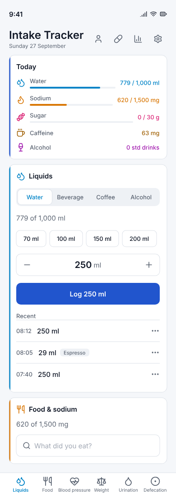
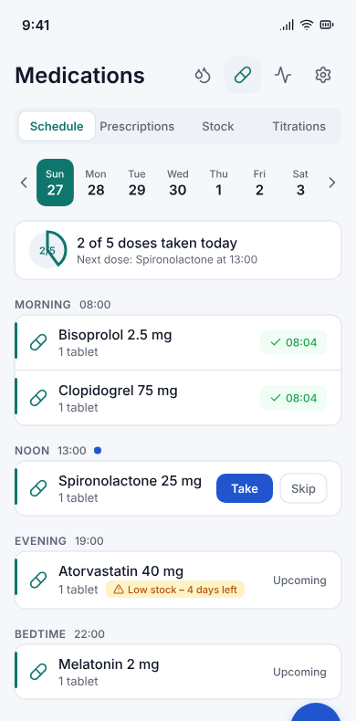
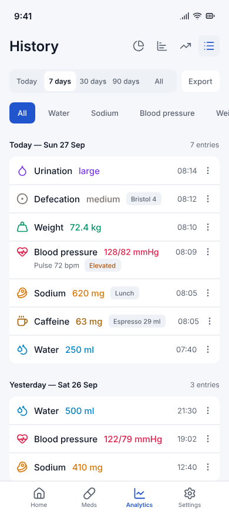
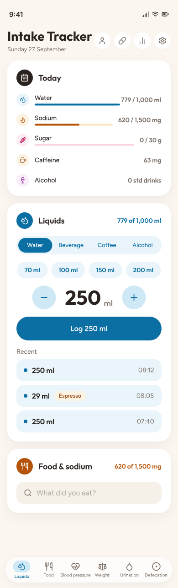
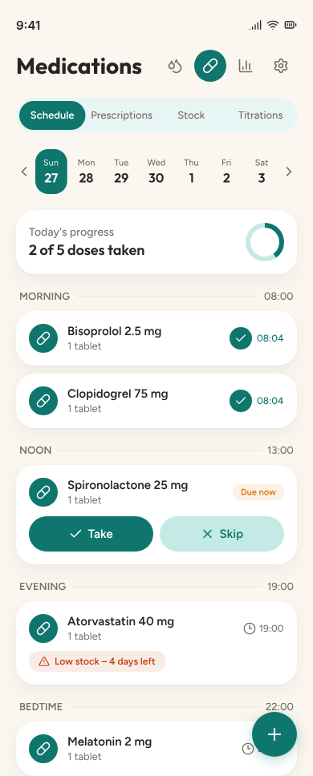
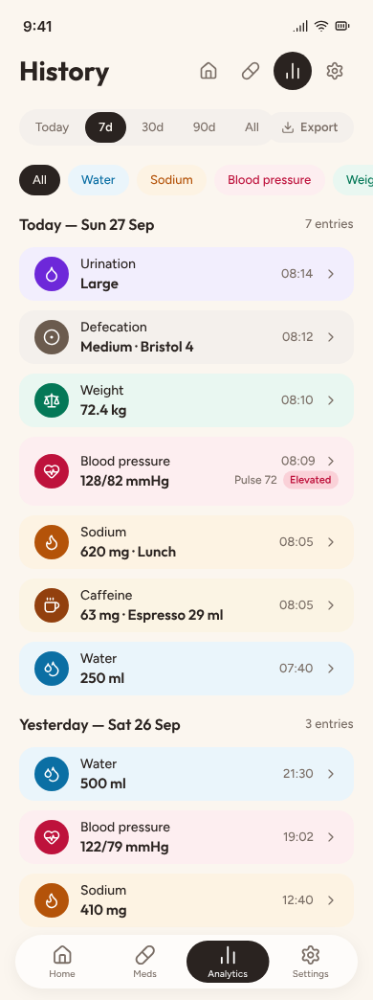
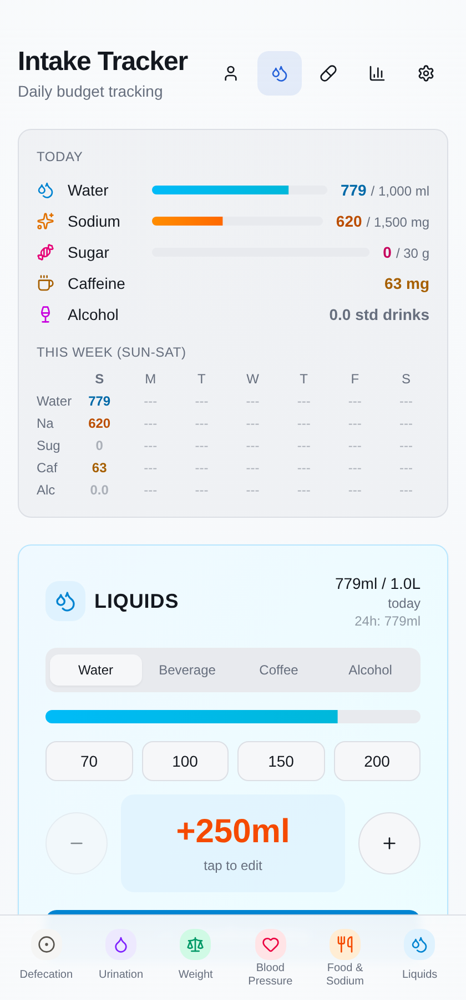
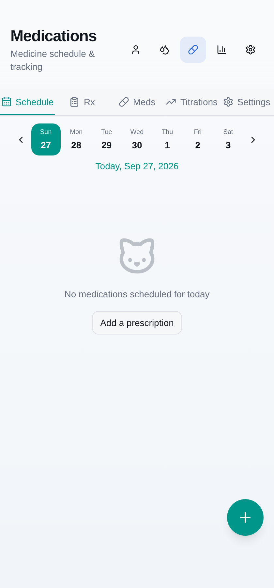
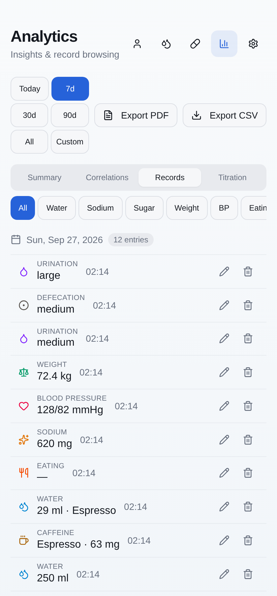

# Styling refresh proposal (September 2026)

**Status:** Proposal. You choose a direction. No app code is changed on this branch.
**Date:** 2026-09-27
**Inputs:** screenshots of the real app (production build, `next start`, 420x900 viewport,
light mode, offline, not signed in, seeded through the UI); the earlier research on the
unmerged branch `claude/pencil-cli-integration` (`docs/design/2026-05-30-intake-tracker-design-brief.md`,
`design/feature-set/*.md`); a scan of `apps/web/src` and `packages/ui/src`.

**Files**

- Screenshots of the app today: `design/refresh-2026-09/current/*.png`
- Mock-ups (Pencil CLI): `design/refresh-2026-09/<direction>-<screen>.png`, with source
  canvases in `design/refresh-2026-09/pen/*.pen`
- Directions: `calm-clinical` (A) and `warm-friendly` (B). Screens: `home`, `medications`, `history`.

> Note on "history": `/history` now only redirects to `/analytics` (`apps/web/src/app/history/page.tsx`).
> The history screen in this proposal is the **Analytics → Records** view.

---

## 1. Summary

The app works, but it looks like a set of separately built cards, not one product. The main
causes:

1. **The brand font is not used.** `layout.tsx` loads Outfit into `--font-outfit`, but no
   token maps `font-sans` to that variable. The computed `font-family` on `body`, `h1` and
   `button` is the Tailwind system stack (Roboto on Android, Arial or Liberation Sans on the
   desktop). `document.fonts` contains no loaded faces. This gap existed before the Tailwind v4
   migration (`356236ec`); the v3 `tailwind.config.ts` had no `fontFamily` either. This one
   issue is probably the largest cause of the "bland" look.
2. **Every card uses a different input style.** The code has 21 files with raw
   `type="number"`, 9 that use `NumericInput`, and 8 that use `InlineEdit`. Heights vary
   (`h-9` x44, `h-10` x20, `h-11` x6, `h-12` x28, `h-14` x6) and so do radii (`rounded-lg`
   x106, `rounded-md` x46, `rounded-xl` x26, bare `rounded` x31).
3. **Colour has no rules.** Each card takes its own hue for the wash, the icon, the button,
   the divider and the selected state. Warning text uses red (`text-red-5/600` in 31 places),
   and the water card shows its "+250ml" amount in orange-red.
4. **Card headers do not follow one pattern.** The UPPERCASE `tracking-wide` titles wrap
   ("BLOOD / PRESSURE"). The right-hand stat slot shows a different kind of content on each
   card.

A refresh can fix all four points without changing behaviour. Both directions below keep
the information architecture, the `CardShell` / `CARD_THEMES` structure and every feature.
They differ only in tone and in tokens.

---

## 2. What is inconsistent today

References are to files in `design/refresh-2026-09/current/`.

### 2.1 Typography

| Issue | Where | Evidence |
|---|---|---|
| Outfit is loaded but not applied. All text uses the system sans font. | Everywhere | computed `font-family` = `-apple-system, … Roboto, … Arial`; no `--font-sans: var(--font-outfit)` in `packages/ui/src/styles/globals.css` |
| Analytics stat values use a **monospace** font (`128/82`, `72.4 kg`, `-21 ml`), so they look like debug output | `analytics-top.png` | `font-mono` in `components/analytics/summary-tab.tsx` and 5 other files |
| Card titles are UPPERCASE and wide-tracked. Long titles wrap onto two lines. | `card-bp.png` ("BLOOD / PRESSURE"), `card-food-salt.png` ("FOOD") | `CardShell`: `font-semibold text-lg uppercase tracking-wide` |
| Primary buttons use different font weights: "Confirm Entry" and "Log Beverage" are bold, "Record Weight" and "Record Reading" are regular | `card-water.png` vs `card-weight.png`, `card-bp.png` | |
| The "optional" label style differs: "Sugar (g) (optional)" in the food and beverage cards, "Sugar (g) — optional" in the coffee and alcohol tabs. Labels are dark in some places and muted in others. | `card-food-salt.png`, `liquids-tab-1-beverage.png`, `liquids-tab-2-coffee.png` | |
| Preset names collide with their volume ("Double Espresso60ml") | `liquids-tab-2-coffee.png` | |
| Not all numbers use tabular figures, so digits in columns do not line up | Weekly grid, recent rows, records list | `tabular-nums` is opt-in (4 components) |

### 2.2 Number inputs (this is the "inconsistent inputs" complaint)

The same job, "enter a quantity", has at least **six** different looks:

| Pattern | Where | Look |
|---|---|---|
| A. Round ± buttons around a tinted "tap to edit" tile, value 48px **orange-red** | Water tab (`card-water.png`) | Tile has a tint. The ± circles are 56px. |
| B. The same pattern, but the value is **blue** | Beverage tab (`liquids-tab-1-beverage.png`) | Same component, different colour |
| C. Round ± buttons around a bare 40px black number with the unit on the right | Weight (`card-weight.png`) | No tile. `InlineEdit` with a hidden input. |
| D. Plain white 48px text boxes with a placeholder, centred | BP systolic/diastolic (`card-bp.png`) | White background, while all other inputs are grey |
| E. Grey 40px text box with the unit as the placeholder ("mg", "g", "ml"), left-aligned | Food (`card-food-salt.png`), coffee and alcohol volume | Unit disappears once you type |
| F. Square ± buttons joined to a centred text box | Settings, "Increment (ml)" (`settings-water-day-inputs.png`) | A fourth stepper shape |

Other details:

- Heart rate puts a separate grey "BPM" block next to the field. Food puts the unit in a
  separate `Select` ("mg"). Water puts the unit inside the value ("+250ml").
- BP systolic/diastolic placeholders (120/80) look like real values at the same weight
  (`card-bp.png`).
- Quick-value chips: the water chips are ~36px, square-ish, number only. The coffee and
  alcohol presets are 40px cards with a bold name and a muted volume. The urination and
  defecation size buttons are 40px with rounded-lg corners. These are three chip styles.

### 2.3 Buttons

- Primary button colour follows the card domain (sky, orange, rose, emerald). That part is
  intended. But the **disabled** state is a faded version of the colour: pale salmon "Record
  with details", pale pink "Record Reading", tan "Log Entry" in the coffee tab, lilac "Log
  Entry" in the alcohol tab. Users read these as "a different colour", not as "disabled"
  (`card-food-salt.png`, `card-bp.png`, `liquids-tab-2-coffee.png`, `liquids-tab-3-alcohol.png`).
- Some primary buttons show a check icon and some do not. Button labels mix "Confirm Entry",
  "Log Beverage", "Log Entry", "Record with details", "Record Reading" and "Record Weight".
- Analytics has a third blue (`#2563EB`-ish, from shadcn `primary`) for "Fast analysis" and
  "7d". Its disabled "No food entries yet" is pale periwinkle (`analytics-top.png`).
- The medications empty state uses an outline "Add a prescription" button with a teal FAB,
  while the wizard uses a teal filled "Next" (`medications-top.png`, `medications-wizard-step1.png`).
- The Analytics range selector is a wrapped grid of 6 outline buttons. "Export PDF" and
  "Export CSV" sit in the same grid, and it takes three rows (`analytics-top.png`).

### 2.4 Card headers and spacing

- Right-hand stat slot: liquids shows three lines ("779ml / 1.0L", "today", "24h: 779ml").
  BP shows four lines (value, "Normal", "Pulse pressure 46", "mmHg" wrapped). Weight shows
  two lines. Urination and defecation show a timestamp. Food shows nothing.
- The icon chip is 36px on every card, but the chip tint changes (for example defecation's
  chip is almost invisible, `card-defecation.png`).
- Card padding is `p-6` (24px). Settings sections use none. Analytics cards use ~`p-4`. Code
  totals: `p-3` x71, `p-2` x37, `p-4` x32, `p-6` x14.
- "Recent" lists: water rows show only the time ("02:12"). Every other card shows "Sep 27,
  02:12". The trash icon sits inline on every row, so deleting is one mis-tap away.
- The fixed quick-nav footer covers the primary button of the liquids card on first load
  (`01-home-top.png`, `liquids-tab-1-beverage.png`).
- The medications sub-tab row overflows the screen: "Settings" is clipped and there is no
  side padding (`medications-top.png`).

### 2.5 Colour

- Card washes are gradients (`from-*-50 to-*-50`). With 6+ cards stacked, the page reads as
  a rainbow and no card stands out (`02-home-full.png`).
- In the coffee tab the progress bar turns amber, but it still shows the **water** total
  (779 ml). The divider stays sky-blue on a yellow card (`liquids-tab-2-coffee.png`).
- BP header: the value `128/82` is rose/red, and the category next to it is green "Normal".
  The number looks alarming and the label says the opposite (`card-bp.png`).
- The Today summary uses a different colour for each number, so no number stands out as
  the one that matters (`01-home-top.png`).
- Settings sub-sections have coloured titles (purple, sky, orange, pink, green, blue, red)
  under neutral section titles (`settings-tracking.png`). The colour carries no meaning here.
- Dark mode is solid: tokens exist and the washes darken well (`home-dark-top.png`). Keep it.

### 2.6 Things that already work (keep them)

- The mobile shell (`max-w-lg`), the header nav with the active pill, and the quick-nav footer.
- Tabs inside the liquids card and one-tap quick values.
- The Today summary with the week grid. It is the best "am I on track" view the app has.
- The Records list in analytics (`analytics-tab-2-records.png`): icon, small caps type label,
  value, time, and edit/delete actions. It is clean and a good pattern to reuse.
- The medication week strip and the wizard's step progress bar.

---

## 3. Design principles for this app

These rank the goals for this app specifically. When two rules conflict, the higher one wins.

1. **One-handed logging.** Primary actions are in the lower half of each card and are full
   width, at least 48px high. The quick-nav must never cover a primary button (add bottom
   padding equal to the nav height).
2. **Fast repeat entry.** The most common entry for each domain takes one tap (quick chips,
   "same again"). Typing is the fallback. Every quantity uses one stepper component with
   `inputmode="decimal"`, the unit shown as a fixed suffix, and validation on blur.
3. **Clear daily progress.** Each budget card has one hero number ("221 ml to go" /
   "620 of 1,500 mg") and one progress visual. Readings (BP, weight, bathroom) show the last
   value and when it was taken. They show no progress bar.
4. **Identity is decoration, status is information.** Domain colour says *which* metric
   this is. A shared status scale says *how it is going* (on track → approaching → over, with
   danger only for clinical readings). Over budget is never alarm red.
5. **One of each thing.** One card anatomy, one stepper, one chip, one segmented control,
   one primary/secondary/tertiary button set, one list row, one empty state. Each is
   specified once in `@intake/ui` and used everywhere.
6. **Numbers are the content.** Tabular figures everywhere, a real display face for numbers,
   and units in muted text beside the value, never in a placeholder.
7. **Calm, factual copy.** Sentence case, no scolding, and one verb for saving: **"Log"**
   ("Log 250 ml", "Log reading", "Log weight").

---

## 4. Direction A — "Calm Clinical"

*A good paper logbook: quiet, precise and dense. Colour appears only where it carries
meaning.* Mock-ups: `calm-clinical-home.png`, `calm-clinical-medications.png`,
`calm-clinical-history.png`.

White cards on a cool grey page. No gradient washes. A 3px left accent bar and the icon
carry the domain colour. The whole app has **one** primary button colour, so the eye learns
where "do it" lives. Inter with tabular numbers gives a crisp, instrument-like reading.

### 4.1 Tokens

**Colour**

| Token | Light | Dark | Use |
|---|---|---|---|
| `bg` | `#F5F7FA` | `#0E1116` | Page |
| `surface` | `#FFFFFF` | `#161A21` | Cards, sheets |
| `surface-sunken` | `#EEF1F5` | `#1D222B` | Segmented track, disabled fill, input rest |
| `border` | `#DCE1E8` | `#2A303B` | Card and input borders, dividers |
| `text` | `#111827` | `#E6E9EF` | Body, values |
| `text-muted` | `#5B6472` | `#9AA3B2` | Labels, units, timestamps |
| `primary` | `#2155CD` | `#6D93F2` | The only filled-button colour; focus ring |
| `status-approaching` | `#B45309` | `#F59E0B` | 80–100% of budget |
| `status-over` | `#92400E` + hatch | `#FBBF24` + hatch | Over budget (never red) |
| `status-danger` | `#B91C1C` | `#F87171` | Clinical only (BP crisis) |
| Domain accents (600 / dark 400) | water `#0284C7`, sodium `#D97706`, sugar `#DB2777`, caffeine `#A16207`, alcohol `#A21CAF`, weight `#059669`, BP `#E11D48`, urination `#7C3AED`, defecation `#78716C`, medication `#0F766E` | +1 step lighter, 15% less saturated | Accent bar, icon, progress fill, selected tab text. Never button fills, never card washes. |

**Type** (Inter, `font-variant-numeric: tabular-nums` on the body; Outfit dropped)

| Role | Size / line | Weight |
|---|---|---|
| Screen title | 24 / 30 | 600 |
| Hero number | 32 / 38 | 600 |
| Card title (sentence case) | 15 / 20 | 600 |
| Body / row value | 15 / 22 | 400 / 500 |
| Field label (above field) | 13 / 18 | 500, muted |
| Caption / unit / timestamp | 12 / 16 | 400, muted |

**Radius:** card 12 · control 10 · chip 8 · pill only for status tags.
**Spacing (4pt grid):** card padding 16 · gap between cards 12 · between sections 24 ·
controls 48 high · chips 36 high · list row 48 min.
**Elevation:** flat. Cards have a 1px border and no shadow. The bottom nav and sheets get
`0 -4px 16px rgb(15 23 42 / .08)`. Dark mode keeps the lightness ladder (`bg` → `surface` →
`surface-sunken`).

### 4.2 Component rules

- **Card:** `surface`, 1px `border`, radius 12, 3px left accent bar in the domain colour.
  Header: 20px domain icon (no chip), sentence-case title, and on the right **one** tabular
  metric line plus at most one muted caption. No gradients.
- **Number input (stepper field):** one joined control `[ − | 250 ml | + ]`, 48 high, 1px
  border, radius 10. Value 20/600 centred, unit as a muted suffix. Tapping the value opens
  typing (`inputmode="decimal"`). BP uses two stepper fields side by side ("Systolic",
  "Diastolic", suffix `mmHg`). Weight and the settings steppers use the same control.
- **Quick chips:** outline, 36 high, radius 8, value plus muted unit. Presets add the name
  on the left and the volume on the right, with ellipsis. A selected chip gets a
  domain-colour border and text.
- **Segmented control:** `surface-sunken` track 40 high, radius 10. The selected segment is
  `surface` with a 1px border and domain-colour text. Use it for the liquids tabs, the
  analytics range and the medications sub-tabs (scrollable when needed).
- **Buttons:** primary is filled `primary`, white 15/600 text, 48 high, full width, radius 10,
  no icon. Secondary is `surface` with a 1px border and `text`. Tertiary is a text button in
  `primary`. Disabled is a `surface-sunken` fill with `text-muted` text, the same for every
  domain.
- **List row:** 48 min height. Time on the left (12/16 muted, tabular), value in the middle
  (15/500 tabular) plus an optional grey tag, and a `⋯` menu on the right for edit/delete (no
  inline trash). Hairline dividers.
- **Empty state:** a dashed-border card, a muted 24px icon, a one-line title, a one-line hint
  and one secondary button. No illustrations.
- **Status:** the progress fill uses the domain colour while on track. It changes to
  `status-approaching`, then to `status-over` with a hatch pattern and a factual readout
  ("+120 mg over"). The BP category chip uses the graduated ladder. Red appears only for a
  crisis reading.

### 4.3 Trade-offs

- Pros: the most legible and the densest. It fits a medication and blood-pressure log.
  Components are the cheapest to build (close to shadcn defaults), and a single primary
  colour removes most colour bugs.
- Cons: it is less personal and could still feel "bland" if the type and spacing are not
  done well. Dropping Outfit gives up the brand face.

---

## 5. Direction B — "Warm Friendly"

*A kind companion: soft, rounded and generous. Each domain has a friendly personality, and
the progress visuals are satisfying.* Mock-ups: `warm-friendly-home.png`,
`warm-friendly-medications.png`, `warm-friendly-history.png`.

Cards on a warm cream page, with no borders and soft layered shadows. Each domain has a
50/100/700 colour ramp. Primary buttons take the domain's strong tone, and budgets become
rings. Outfit (applied at last) sets the headings and all numbers. Figtree sets the body.

### 5.1 Tokens

**Colour**

| Token | Light | Dark | Use |
|---|---|---|---|
| `bg` | `#FBF6EF` | `#17130F` | Page (warm cream / warm charcoal) |
| `surface` | `#FFFFFF` | `#211C17` | Cards |
| `surface-raised` | `#FFFFFF` + shadow | `#2B241E` | Sheets, FAB |
| `hairline` | `#EDE3D6` | `#3A3129` | Rare dividers |
| `text` | `#2A2320` | `#F4EDE4` | Body |
| `text-muted` | `#7A6E66` | `#B3A69A` | Labels, units |
| `ink` | `#2A2320` | `#F4EDE4` | Non-domain primary (settings, auth) |
| `status-approaching` | `#D97706` | `#FBBF24` | 80–100% |
| `status-over` | `#C2410C` + hatch | `#FB923C` + hatch | Over budget (clay, not red) |
| `status-danger` | `#B91C1C` | `#F87171` | Clinical only |

Domain ramps (50 tint / 100 soft / 700 strong). The dark theme uses 950/900/300.

| Domain | 50 | 100 | 700 |
|---|---|---|---|
| Water | `#EAF5FB` | `#CFE8F6` | `#0B6FA4` |
| Sodium | `#FDF3E3` | `#FBE3BD` | `#B45309` |
| Sugar | `#FDEEF4` | `#FAD3E3` | `#BE185D` |
| Caffeine | `#FBF4E4` | `#F3E2B8` | `#92400E` |
| Alcohol | `#F9EEF9` | `#F0D5F1` | `#86198F` |
| Weight | `#E9F7F1` | `#C9EDDD` | `#047857` |
| Blood pressure | `#FDEEF0` | `#FAD1D8` | `#BE123C` |
| Urination | `#F2EEFD` | `#DDD3FA` | `#6D28D9` |
| Defecation | `#F4F0EC` | `#E4DAD1` | `#6B5B4E` |
| Medication | `#E7F6F4` | `#C4EAE5` | `#0F766E` |

The 700 tones all pass 4.5:1 with white text. That is the rule behind the choice of 700
instead of today's 500/600 fills.

**Type** (Outfit for headings and numbers, Figtree for body. Both use `next/font`. Fix the
`--font-sans` / `--font-display` mapping.)

| Role | Face | Size / line | Weight |
|---|---|---|---|
| Screen title | Outfit | 28 / 34 | 700 |
| Hero number | Outfit, tabular | 44 / 48 | 700 |
| Card title (sentence case) | Outfit | 18 / 24 | 600 |
| Body / row | Figtree | 16 / 24 | 400 / 500 |
| Label | Figtree | 14 / 20 | 500 |
| Caption | Figtree | 13 / 18 | 400, muted |

**Radius:** card 24 · input 16 · buttons, chips and segmented controls fully pill-shaped.
**Spacing:** card padding 20 · gap between cards 16 · between sections 28 · buttons 52 high ·
chips 40 high.
**Elevation:** no card borders. Shadow `0 1px 2px rgb(42 35 32 / .04), 0 8px 24px rgb(42 35 32 / .06)`.
Sheets use `0 -12px 32px rgb(42 35 32 / .12)`. Dark mode drops the shadows and uses the
lightness ladder.

### 5.2 Component rules

- **Card:** white, radius 24, soft shadow, no border, no gradient wash. Header: a 36px circle
  filled with the domain 700 tone and a white Lucide icon, then the Outfit title, then a
  friendly readout on the right ("221 ml to go").
- **Budget visual:** a progress **ring** (domain 700 on a domain 100 track) for water and
  sodium on the dashboard. Thin bars are used only in the Today summary.
- **Number input (dial):** a big Outfit value with a muted unit, centred. On each side sits
  a 52px round button filled with the domain 100 tone. Tapping the value opens typing
  (`inputmode="decimal"`). Settings use a compact 44px version of the same dial.
- **Quick chips:** pills 40 high with a domain 50 fill and domain 700 text. The selected chip
  is a domain 700 fill with white text.
- **Segmented control:** a pill track in domain 50 (neutral cream on non-domain screens). The
  selected pill is a domain 700 fill with white text.
- **Buttons:** primary is a pill, domain 700, white 16/600, 52 high. Secondary is a pill with
  a domain 100 fill and domain 700 text. Tertiary is a text button. Disabled is a `hairline`
  fill with muted text, the same across domains.
- **List row:** a rounded-16 tile on the domain 50 tint, 56 high. A domain dot or icon, the
  value in bold Outfit, and the time muted on the right. Swipe left to edit or delete. A long
  press opens a menu as a fallback.
- **Empty state:** centred. A 72px soft circle in domain 50 with a Lucide icon, one warm line
  ("Nothing scheduled today"), and a pill primary button. This replaces the cat.
- **Status:** the ring or bar changes from the domain 700 tone to `status-approaching`, then
  to clay `status-over` with a hatch and a factual label ("120 mg over"). Red is used only
  for clinical danger.

### 5.3 Trade-offs

- Pros: it answers "bland" most directly. It has a clear personality, satisfying rings and a
  warmer tone, and it finally uses Outfit. Domain colour still helps you find each card, but
  in a controlled way.
- Cons: bigger type and padding mean more scrolling on the dashboard (use the card
  hide/reorder settings). There are more tokens to maintain (10 ramps × 3 tones × 2 themes).
  Rings and dials cost more to build than Direction A's stepper field.

---

## 6. Side-by-side

| | A · Calm Clinical | B · Warm Friendly |
|---|---|---|
| Mood | Instrument, logbook | Companion, journal |
| Page | Cool grey `#F5F7FA` | Cream `#FBF6EF` |
| Cards | White, 1px border, 3px accent bar, radius 12 | White, soft shadow, no border, radius 24 |
| Primary button | One app blue for everything | Domain 700 tone, pill |
| Fonts | Inter only | Outfit (display, numbers) + Figtree (body) |
| Budget visual | Thin bar + number | Ring + "to go" |
| Number input | Joined `[− value +]` field | Big dial with round buttons |
| Density | High (more on screen) | Medium (more scrolling) |
| Build cost | Low–medium | Medium |

Both directions share these fixes, which are worth doing whichever you pick:

1. Apply the real font (`--font-sans` mapping). Make tabular numbers the default.
2. Replace the six quantity-input patterns with **one** stepper component in `@intake/ui`.
3. Remove gradient washes and uppercase card titles. Use one disabled style.
4. Replace red over-budget text with the status scale. Recolour the BP header value by its
   category, not with a fixed rose.
5. Pad the bottom of the page so the quick-nav never covers a button. Make the medications
   sub-tabs fit or scroll with padding.
6. Use one verb ("Log") and one "(optional)" label style.
7. Replace `font-mono` in analytics stats with the display face.

### Mock-ups

| | Home dashboard | Medications (schedule) | History (Analytics → Records) |
|---|---|---|---|
| **A · Calm Clinical** |  |  |  |
| **B · Warm Friendly** |  |  |  |
| **Today (for comparison)** |  |  |  |

Caveats on the mock-ups. They are direction sketches, not specs.

- They were generated headlessly with `@pencil.dev/cli` v0.2.7, one process at a time, from
  the token tables above. They show mood and component rules. They are not pixel specs.
- The medications mock-ups use invented example medicines and dose states. The real schedule
  is empty on this device.
- Both history mock-ups added a bottom tab bar (Home, Meds, Analytics, Settings). The real
  app does not have one; it uses the header nav. Ignore the tab bar. The medications tabs were
  renamed "Prescriptions" and "Stock" (and Settings removed) to show that the row can fit.
  That rename is only a suggestion.
- The first history renders had a stray duplicate row outside the screen frame and an
  overlapping BP row. A second Pencil pass fixed both in A. In B the pass fixed the BP row,
  but it moved the stray row away from the frame instead of deleting it. The B history PNG is
  therefore the Pencil export **cropped to the screen frame**, with no other edits. The stray
  node is still present on `pen/warm-friendly-history.pen`, outside the frame.

## 7. Suggested next step

Choose A or B (or say which parts of each you want). The implementation order would be:
tokens in `packages/ui/src/styles/globals.css` → font fix → one stepper, chip, segmented
control and button set in `@intake/ui` → `CardShell` restyle → dashboard cards one at a time
(each as a small PR with before/after screenshots) → medications → analytics → settings.

## Appendix — how the screenshots were taken

`next build` + `next start -p 3109` in `apps/web`. Headless Chromium through Playwright,
420x900 at 2x DPR, service workers blocked, `intake-tracker-welcome-seen` set in
localStorage, not signed in (offline mode). Records were seeded through the real UI: 3 water
logs, 1 espresso preset, a 620 mg sodium meal, BP 128/82, weight 72.4 kg, urination medium
and large, defecation medium. Fonts in the screenshots are the headless-Linux fallback
(Liberation Sans / Arial), which confirms that Outfit is not applied. On Android the same
code renders in Roboto.
